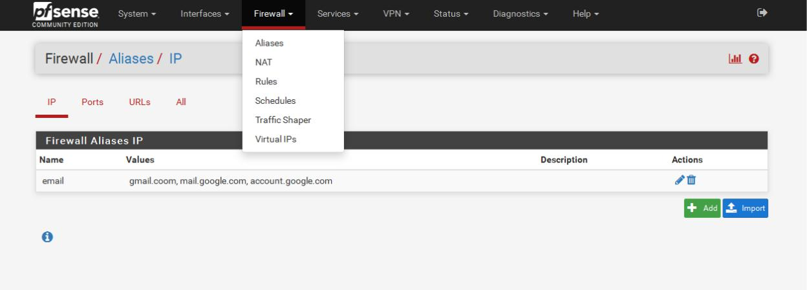
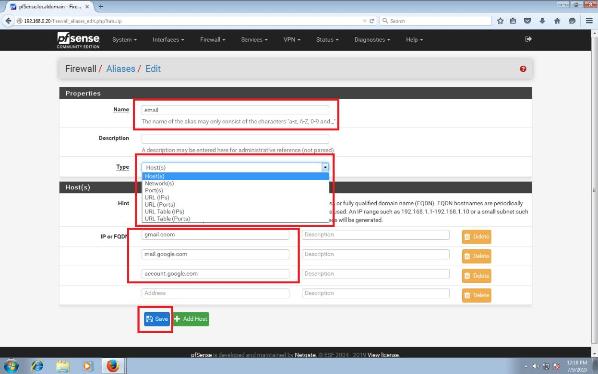

# 10. Cấu hình Aliases cho pfsense

\*\*\*\*

Đầu tiên, ta chọn firewall- aliases, sau đó nhấn add để thêm alias vào từng mục như ip, port, urls, all.

Sau khi chọn add. Ta đặt tên cho alias, tiếp theo ở mục type chúng ta có các tùy chọn sau:

* **Host**: là một địa chỉ IP cụ thể, một tên DNS, một tên của host nào đó…
* **Network**: định nghĩa một mạng cụ thể, ví dụ: 10.10.10.0/24
* **Port:** định nghĩa danh sách các port dịch vụ cần áp dụng chính sách.
* **URL**: là một danh sách được định nghĩa trong dạng một file text. Hệ thống sẽ tự

động cập nhật theo danh sách này, với dạng như bên dưới. Ví dụ: [https://engisv.info/sp\_file/IP\_list1.txt](https://engisv.info/sp_file/IP_list1.txt)

Sau đó ta danh sách alias cần thêm vào ở mục phía dưới mục type. Rồi save lại. như vậy là chúng ta đã có 1 danh sách alias mới để thêm vào NAT.

