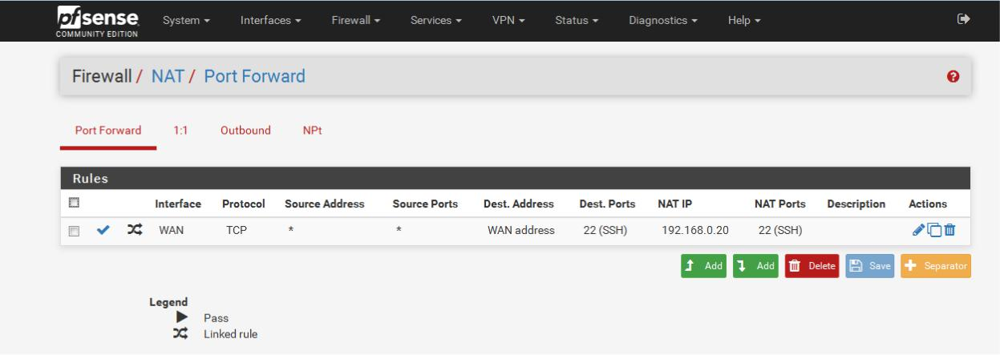
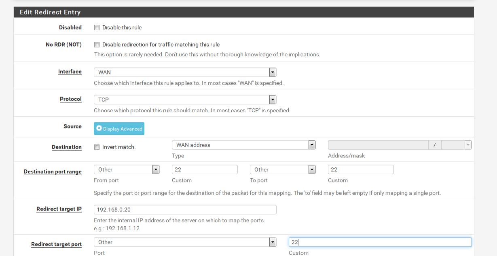
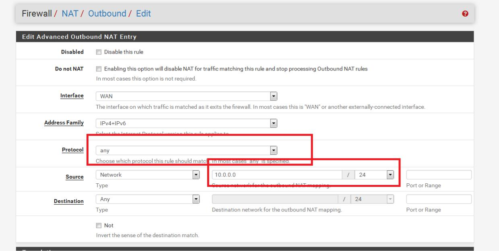

# 11. Cấu hình NAT Port ,outbound cho pfsense

\*\*\*\*

Đầu tiên, chúng ta chọn firewall – nat. Ở bảng port forward chúng ta chọn add

* giao diện này, chúng ta có mục interface dùng để chọn các wan trong môi trường thực tế có thể là vnpt,viettel,..
* mục protocol ta có các tùy chọn như tcp,udp,icmp,… ở hình dưới chúng ta

chọn nat ssh, nên sẽ chọn giao thức tcp. Tiếp theo ở mục destination và redirect port chúng ta chọn port 22 ở mục custom hoặc chọn trực tiếp là ssh.

* mục redirect target ip chúng ta chọn ip theo ip lan trên pfsense. Sau đó nhấn save và apply để lưu lại. Chúng ta có thể kiểm tra port đã mở thông qua các trang web check port bằng cách nhập ip của card wan và port để kiểm tra.

Về cấu hình outbound thì tương tự như đặt rule. Chúng ta cũng chọn protocol, ở mục source thì chúng ta nhập ip hoặc dãy mạng được cấp phép đi ra internet. Sau đó save lại.

