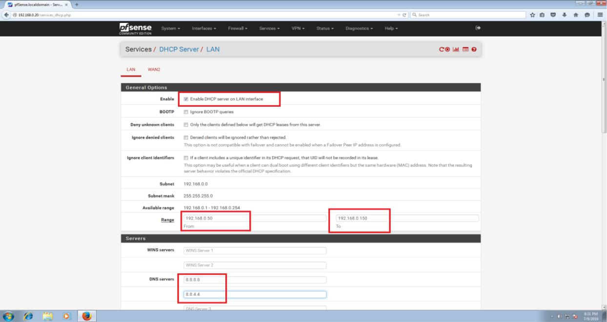
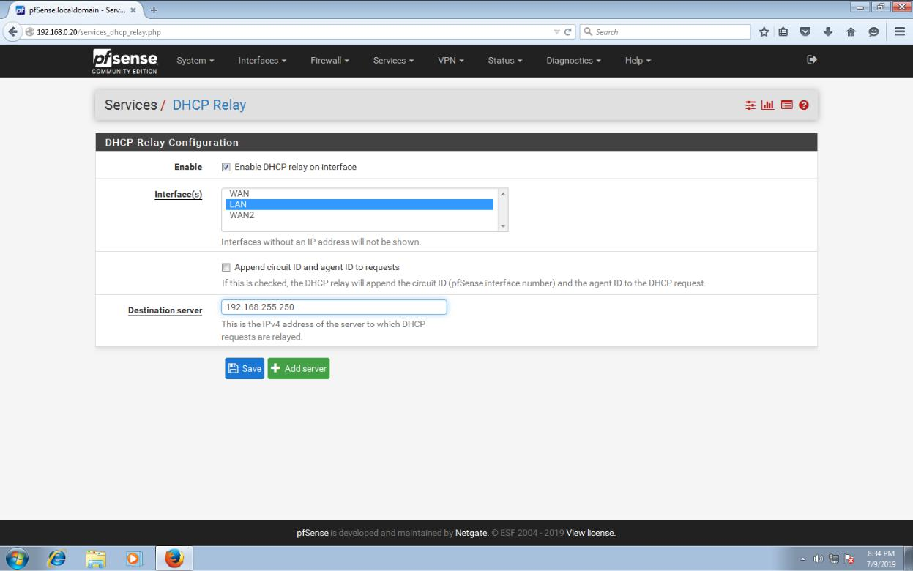

# 12. Cấu hình DHCP cho pfsense

\*\*\*\*

Để cấu hình dhcp ta chọn services – dhcp server. Ta tích chọn vào enable. Ở mục range chúng ta chọn ip bắt đầu và kết thúc để cấp phát cho máy client. ở mục dns servers thì ta có thể chọn dns của google để dùng nếu không có dns servers riêng.Chọn save để lưu lại và kích hoạt lại network của máy client để kiểm tra.

* dhcp relay thì ta chọn services- dhcp relay, chỉ cần chọn enable, interface và nhập ip của dhcp server rồi save lại là xong.

