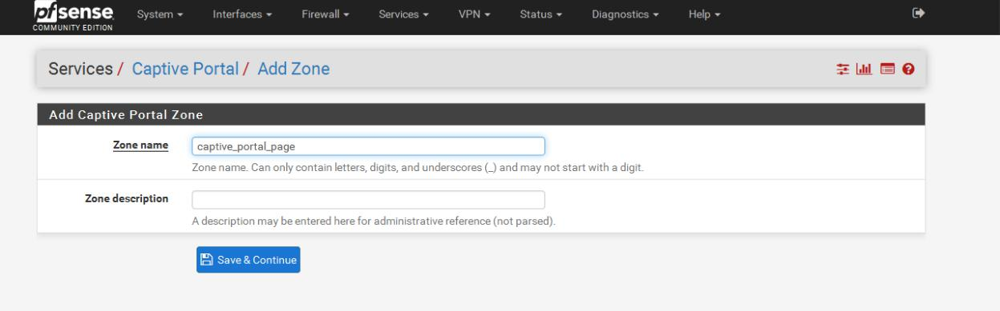
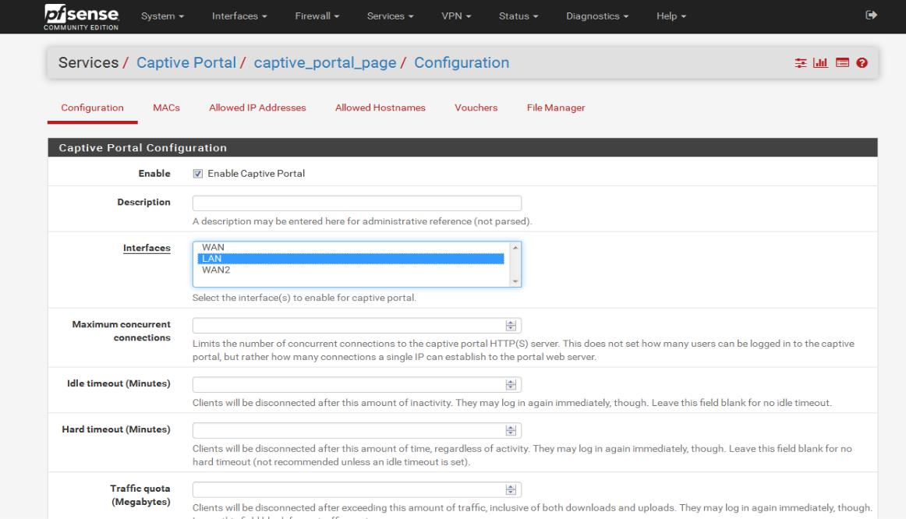
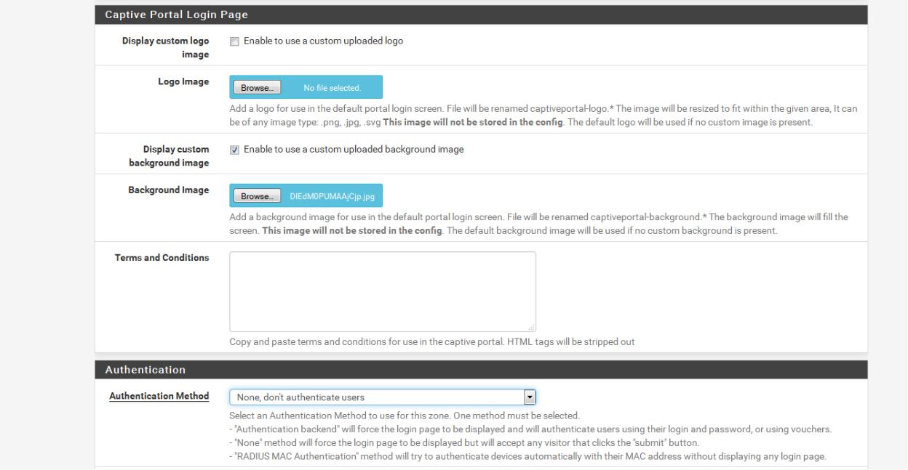

# 13. Cấu hình Captive Portal cho pfsense

\*\*\*\*

Để cấ hình captive portal ta chọn services – captive portal – add zone. Sau đó nhập tên zone vào, lưu ý không gõ dấu cách khi đặt tên. Sau đó nhấn save để tiếp tục.

Sau khi đặt zone ở giao diện tiếp theo, chúng ta tích chọn enable và chọn interface cần đặt captive portal.

Tiếp theo ta có thể up template web theo dạng php hoặc html vào mục html page contents. Còn trong trường hợp không có template thì ta tích chọn enable to use a custom up background image hoặc logo rồi up file ảnh lên. Ở mục authencation có thể chọn none,don’t authenicate users để người dùng có thể vào truy cập internet mà không cần xác thực. Sau đó apply và đến máy client kiểm tra và nhớ kích hoạt dhcp servers.

Vào máy client đăng nhập thì ta có kết quả như hình dưới.

