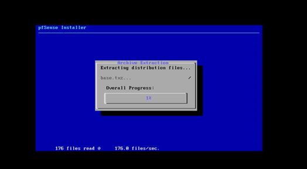

# 3.	CÀI ĐẶT PFSENSE

– Để chuẩn bị cho bài lab cấu hình Loadbalancing trên pfSense. Chúng ta sẽ thiết lập lại “Virtual Network Editor” bằng cách chọn “Edit -&gt; Virtual Network Editor”

– Chỉnh lại VMnet0 từ “Bridged \(auto\)” sang chọn card wifi nếu như bạn dùng wifi hoặc card có dây, để auto có khả năng cao pfsenes không nhận được \( bấm Change Settings nếu đòi quyền administrator\)

-Bây giờ tạo 1 máy ảo Pfsense như cách tạo máy ảo khác.

-Một máy ảo Pfsense cần phải 2 cark mạng: 1 card cho Lan và 1 card cho Wan.

-Edit → Add → Netword Adapter → Finish.

-Tinh chỉnh từng card như sau:

  

-Tại network adapter 2 có thể chọn host only để dùng chung dải ip với máy thật,

ở  đây vì làm hoàn toàn trên máy ảo sẽ tạo 1 Lan ảo để có thể dễ chia ip theo ý. -Sau đó chạy mảy ảo pfsense

– PfSense sẽ tự chọn mode khởi động

Bấm Accept

Bấm OK để Install pfSense

  

Bấm Select

Bước tiếp theo bấm OK để pfSense cài đặt

  

Bước cuối bấm No rồi Reboot lại hệ thống

