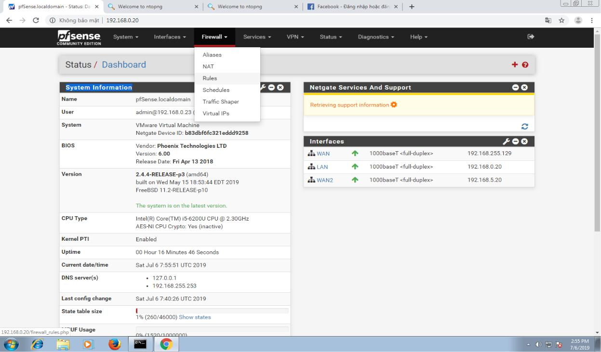
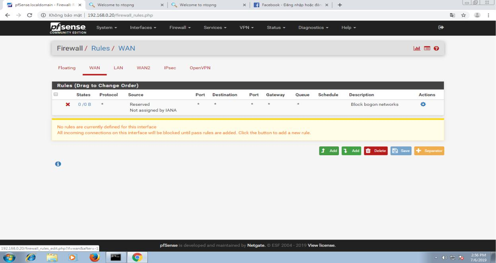
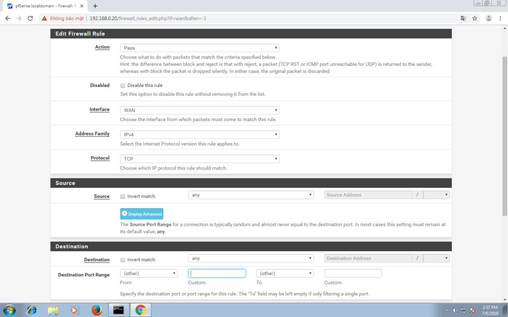
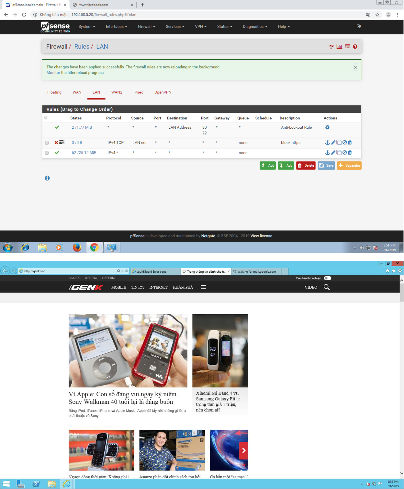

# 5. Hướng dẫn đặt rules cho pfsense

Tại giao diện của pfsense ta chọn filewall, rồi chọn rules.

Xuất hiện cửa sổ mới như hình dưới bao gồm các tùy chọn card wan,lan để đặt rules. Phía dưới gồm các nút chọn add rules vào trên cùng,add rules vào dưới cùng, xóa, lưu.

Ta chọn vào nút add thì cửa sổ mới xuất hiện.

* Ở phần action ta chọn pass để cho phép, block và reject để chặn.
* Tại ô interface ta có thể chọn interface nào áp dụng cho rule.
* Tại ô protocol có các tùy chọn giao thức để cho phép hay chặn.
* Phần source có các tùy chọn như lan, wan,any để chọn các ip hay dãy ip nguồn cho rule.
* Phần destination tương tự như source nhưng dung để chọn ip đích.
* phần destination port range dung để chọn các port.

Lưu ý khi chọn nguồn à đích:

**– Any**: Tất cả.

**– Single host or alias**: Một địa chỉ ip hoặc là một bí danh.

**– Lan subnet**: Đường mạng Lan.

**– Network**: địa chỉ mạng.

**– Lan address**: Tất cả địa chỉ mạng nội bộ.

**– Wan address**: Tất cả địa chỉ mạng bên ngoài.

**– PPTP clients**: Các clients thực hiện kết nối VPN sử dụng giao thức PPTP.

**– PPPoE clients**: Các clients thực hiện kết nối VPN sử dụng giao thức PPPoE.

Sau khi thiết lập các tùy chọn trên thì ta chọn apply để rule được xử lý.

DEMO:

Sau khi ta đặt rule chặn port https thì trang http như hình dưới là genk vẫn truy cập được bình thường. Còn trang https là gmail thì không.

