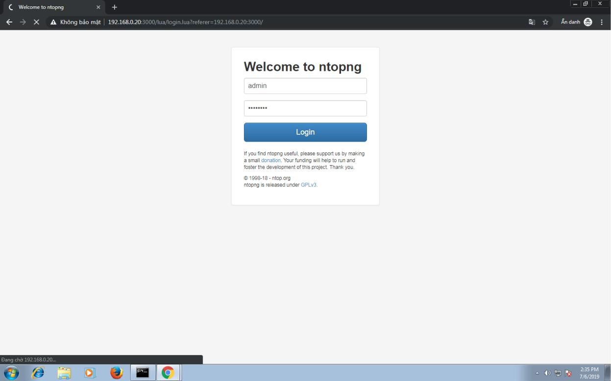

# 6. Cài đặt và cấu hình Monitor NTOP cho pfsense

\*\*\*\*

Để cài đặt ntop, ta chọn system-packeage Manager chọn available packages. Sau đó gõ vào thanh search ntop. Rồi chọn apply để cài đặt. Như hình dưới thì ntopng đã được cài đặt.

Sau khi cài đặt xong ta chọn menu diagnostics chọn ntopng settings. Sau đó tích chọn vào enable ntopng và keep data/settings.

Tiếp tục nhập mật khẩu cho tài khoản admin.

Sau khi thiết lập xong, ta chọn apply để lưu cấu hình. Sau đó vào port 3000 của ip pfsense. Thì xuất hiện giao diện đăng nhập như hình. Ta nhập admin và mật khẩu vừa tạo lúc nãy.

Đăng nhập thành công thì ta sẽ có giao diện monitor chứa log của các host như hình sau.

Với ntop ta có thể lọc log qua giao diện thông qua các tùy chọn hosts, status, direction, application,… như hình dưới ta có màn hình hiện thị log lọc theo facebook.

