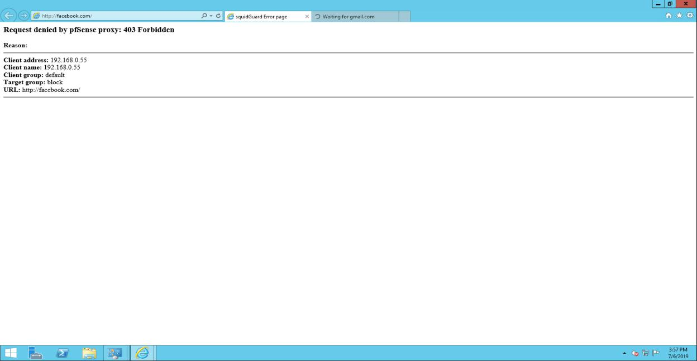

# 7. Cài đặt và cấu hình squid proxy, squidguard cho pfsense

\*\*\*\*

Đầu tiên, để cài đặt squid proxy và squidguard. Ta vào system – package manager – available packages để tìm và cài đặt.

Sau khi cài đặt xong kích chuột vào services sẽ xuất hiện 1 số tùy chọn của squid. Ta chọn squid proxy server. Ở bảng chọn general sẽ có 1 số tùy chọn như enable

– bật squid proxy, keep setting – để khi cài đặt lại squid thì cài đặt vẫn được giữ nguyên. Ngoài ra còn có tùy chọn interface,proxy port,…

Ở mục localcache - Cache Replacement có 4 lựa chọn :

**Heap LFUDA :** Giữ các đối tượng phổ biến trong bộ nhớ cache bất kể kích thước của chúng nhờ đó tối ưu hóa tốc độ truy cập website của user

**Heal GDSF :** Tối ưu tốc độ truy cập website bằng cách lưu cache cho các đối tượng có dung lượng nhỏ hơn.

**LRU:** Giữ các đối tượng được truy cập gần nhất , các đối tượng có thời gian truy cập lâu nhất sẽ bị xóa bớt khỏi cache

– **Tiếp theo cấu hình tích hợp antivirus**.Chọn “**Services** &gt; **Squid** **Proxy** &gt; **Antivirus** Tab” .Tích vào “**Enable Squid antivirus check using ClamAV**” , Tích “**Enable Google Safe Browsing support**“, “**ClamAV Database Update : every 1 hour**” -&gt; Click “**Save**” để lưu cấu hình.

Cuối cùng, chúng ta vào [http://whatismyipaddress.com/proxy-check](http://whatismyipaddress.com/proxy-check) để kiểm tra xem proxy server có hoạt động chưa như hình dưới thì proxy server đã hoạt động.

Tiếp theo để cấu hình squidguard, ta vào mục services, chọn squidguard. Ở Gerneral setting, ta chọn enable và apply để kích hoạt squidguard.

Tiếp theo, ta chọn Target categories, nhấn nút add để thêm. Như hình bên phải ở dưới ta có tùy chọn tên là block với một số domain list đã được điền trước, cùng 1 số danh sách regular.

Chúng ta chuyên sang phần Common ACL, tích vào dấu + ở Target rules list để hiện thị danh sách target vừa được thêm lúc nãy. ở phần access ta chọn deny để chặn truy cập vào danh sách vừa thêm hoặc allow để cho phép truy cập. nhấn save để lưu cài đặt.

Sau khi cài đặt và cấu hình, ta truy cập thử vào facebook thì trang đã bị chặn với thông báo như hình.

