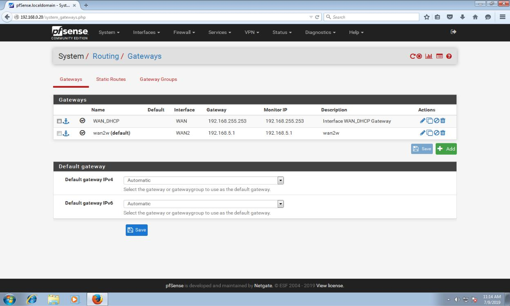
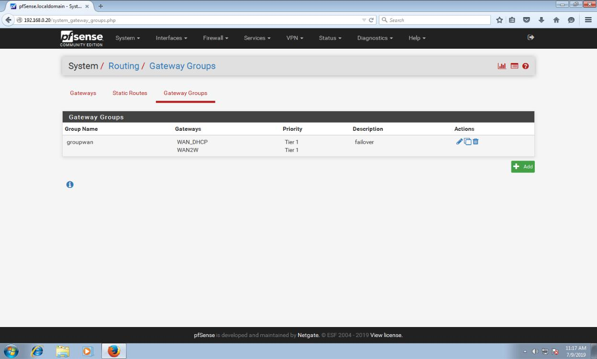
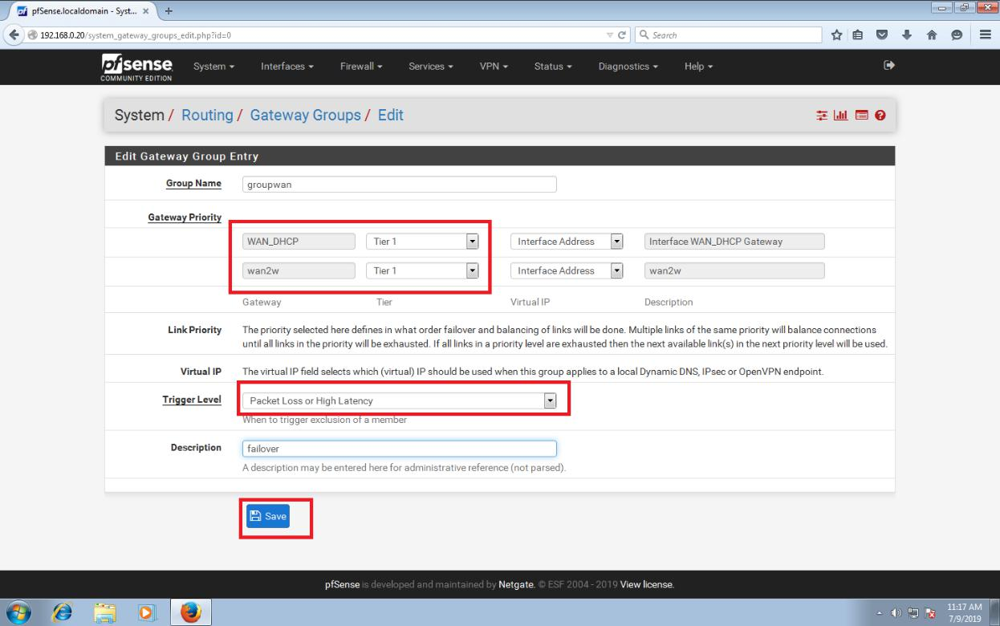
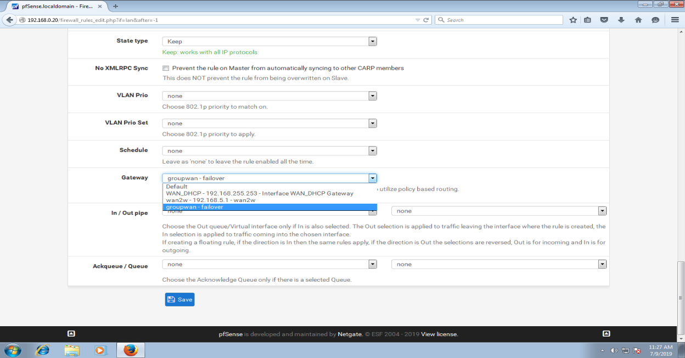
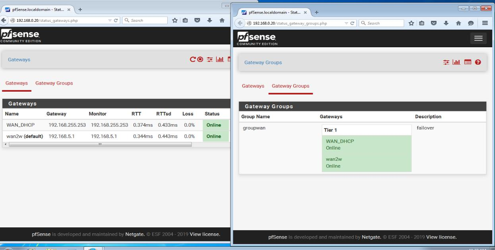

# 8. Cài đặt và cấu hình failover và loadbalancing cho pfsense

\*\*\*\*

Để thiết lập loadbalancing thì ta thiết lập 2 mạng wan. Sau đó chọn system-routing. Như hình ta thấy có 2 mạng wan.

Sang phần gateway groups ta chọn mục add để thêm group

* cửa số mới, ta có phần gate priority, Trong bài LAB chỉ tạo ra 2 WAN ,nếu có nhiều 2 WAN các bạn có thể thực hiện load balance và failover trên cùng một GW Group, ta có thể cho WAN1 và WAN2 cùng tier để load balance, WAN3 có tier lớn hơn để phòng khi 2 WAN kia bị down thì WAN3 sẽ thực hiện failover. phần trigger level thì có các tùy chọn sau:

Member down: chỉ kích hoạt khi 1 trong 2 đường truyền down hoàn toàn

Packet loss: kích hoạt failover khi mất gói tin cao hơn ngưỡng định \(đơn vị gói\)

High Latency: kích hoạt failover khi độ trễ cao hơn ngưỡng định \(đơn vị giây\)

Lựa chọn cuối cùng là kết hợp cả 2 trường hợp trên , tùy chọn này hay được dùng nhất.

Sau khi chọn xong ta chọn save để lưu lại.

Ta có thể vào rules của pfsense để thêm cái tùy chọn của loadbalancing,failover cho pfsense bằng cách nhấn display advanced ở mục extra options. Rồi chọn ở mục gateway.

Ta có thể kiểm tra trạng thái của các gateway và ở group ở mục status- gateways, gateway Groups như hình dưới. Đồng thời ta có thể kiểm tra trả năng hoạt động của failover bằng cách disconnect 1 card wan ở pfsense sau đó vào máy client truy cập internet để kiểm tra.

