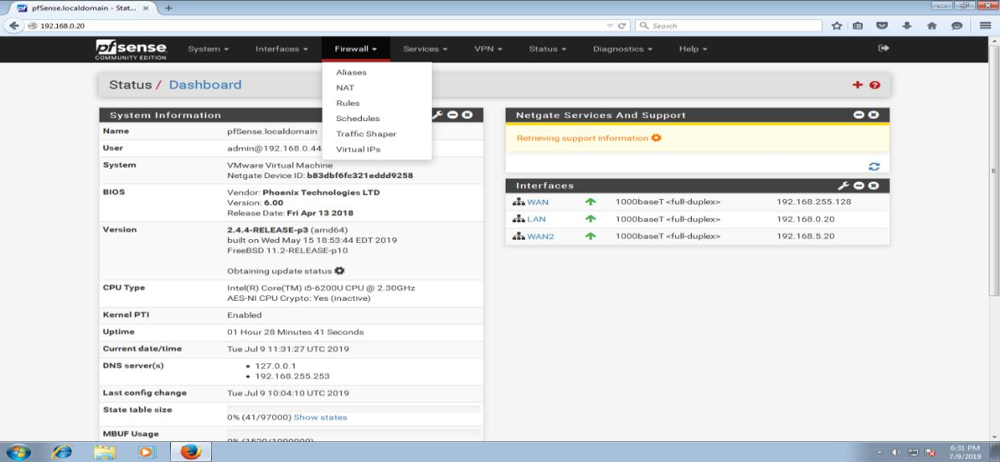
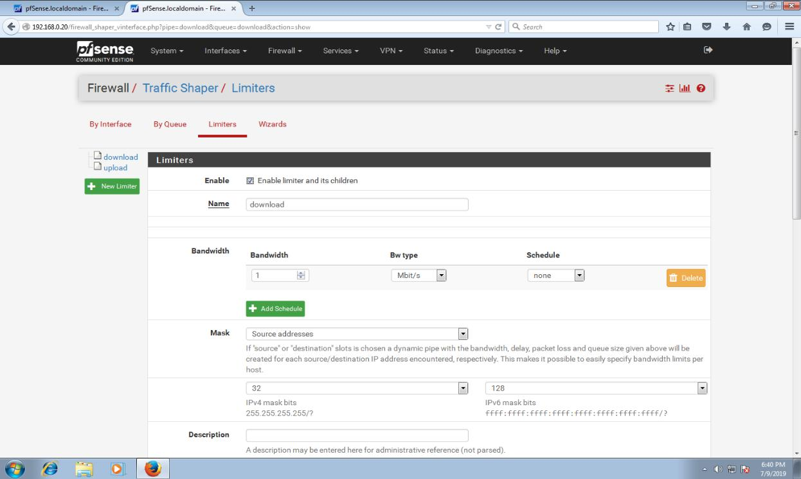
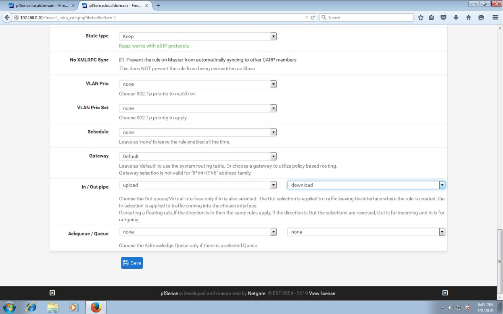

# 9. Cài đặt và cấu hình Traffic Sharper cho pfsense

\*\*\*\*

Đầu tiên chúng ta chọn firewall – traffic shaper.

* giao diện của traffic shaper, ta chọn mục limiters. Tích chọn enable. Và đặt tên limit, ở mục bandwidth chúng ta đặt giới hạn bằng thông cần chọn. ở hình dưới là 1Mbps/s. ở mục mask nếu chúng ta chọn giới hạn download thì chọn là source, còn nếu giới hạn upload thì chọn là destination. Sau đó save lại.

Sau khi thiết lập xong giới hạn, chúng ta có thể thêm vào rules của firewall để giới hạn băng thông bằng cách add rule, vào mục in,out pipe thiết lập theo thứ tự là upload- download.

